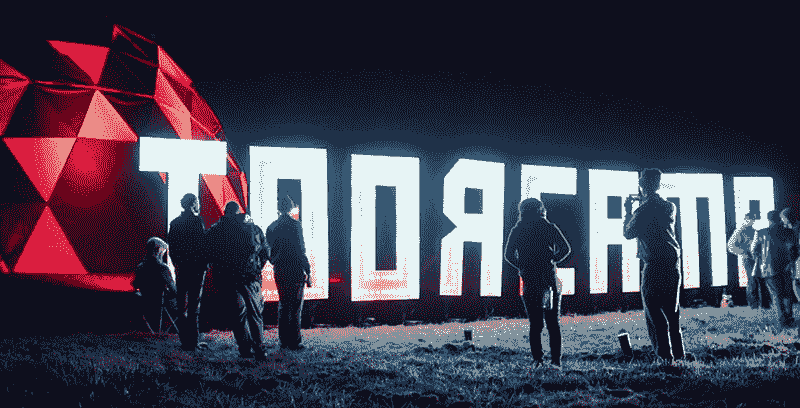

# 扎克·阿彻:为 ToorCamp 现场编码 500 瓦

> 原文：<https://hackaday.com/2019/02/28/zach-archer-live-coding-500-watts-for-toorcamp/>

ToorCamp 是一个为期五天的露天科技露营活动，每两年在华盛顿州的西北角举行一次。你可以把它想象成一个类似燃烧的人的东西，除了你可以在没有水的情况下生存三个小时，没有一大堆名人和 Instagram 名人乘坐私人飞机，每个人都可以建造一些东西。哦，ToorCamp 有送货无人机可以给你送焦糖布丁。这些迷你奶油布丁可能是用挂在焊接台上的热风枪制成的。别担心，你会呼吸到新鲜空气来平衡重金属中毒。

对于去年的 ToorCamp，最大的欢迎标志是一个 40 英尺长的发光 ToorCamp 标志。这是由扎克·阿彻(Zach Archer)设计、建造和编码的，他在 2018 年 Hackaday 超级大会上向我们介绍了他是如何制造它以及如何编码的细节。

## 现场编码 500 瓦

除了制造 8 英尺高的字母、用塑料包裹它们、将它们运输到一个岛上、运行电源以及确保所有东西都防水的机械问题之外，还有决定在 40 英尺宽的显示器上放什么的问题。这很难，因为如果你有几个月的时间来做一个项目，你可以做出一些杀手级的动画。扎克没有几个月的时间。他有几个星期的时间，在这段时间里，他必须实际建立标志。解决办法？现场编码。

从 ToorCamp 背后的人同意安装一个巨大的 LED 到营地进行大量编码的日期之间没有任何时间，但 Zach 已经为现场编码 LED 工作了一段时间。他在西雅图的 Ada's Technical Books 用相同的技术在 ToorCamp sign 建立了一个令人难以置信的装置，即使这个相对较小的装置也展示了他的脚本语言的力量。你可以使用 RGB LEDs 获得火焰效果，如果你把这种效果颠倒过来变成绿色，你就会得到一个*矩阵*风格的屏幕保护程序。

为了证明这一点，Zach 在超级会议期间走上舞台展示他的 LED 照明系统。这个系统是这样设置的，微控制器控制发光二极管(到目前为止一切顺利)，微控制器从计算机接收命令。像这样的系统允许你在飞行中改变 LED，大大加快了设计定制 LED 动画的时间。

虽然扎克没能从 ToorCamp 带来一个巨大的 LED 字母，但他确实带了一个由 WS2812 LEDs 制成的小型 LED 显示屏。通过这种设置，他能够首先将所有的 led 设置为红色，然后只用几行代码就在 led 中实现了一个波形图案。所有这些函数都是在一个数组上进行的数学运算，只要有正确的代码，就可以很容易地用 led 建立一个 Mandelbrot 集合。

这场演讲是 2018 年 Hackaday 超级大会的亮点之一。你很少能看到现场编程的成功，但是这一次进行得很顺利。也许这只是我们对闪闪发光的癖好，但这是一个最好的例子，说明在连接到 led 的微控制器上运行正确的固件可以做什么。

 [https://www.youtube.com/embed/eY7vcnMi9TY?version=3&rel=1&showsearch=0&showinfo=1&iv_load_policy=1&fs=1&hl=en-US&autohide=2&wmode=transparent](https://www.youtube.com/embed/eY7vcnMi9TY?version=3&rel=1&showsearch=0&showinfo=1&iv_load_policy=1&fs=1&hl=en-US&autohide=2&wmode=transparent)

