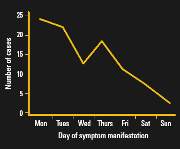
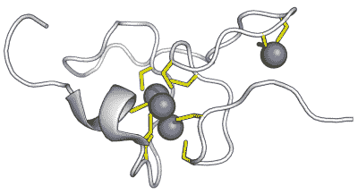

# 锌热:看与热金属一起工作的风险

> 原文：<https://hackaday.com/2021/04/12/zinc-fever-a-look-at-the-risks-of-working-with-hot-metal/>

因为尽管 Hackaday 文章的评论区可能会很嘈杂，但我们真的很喜欢那里发生的交换。我们的读者有着惊人的背景和经历，事实上，每个人都很乐意分享这些经历和他们产生的强烈观点，这是这个社区如此强大和有用的原因。

但是有这么多的观点和经验被分享，有时很难深入到一个问题的本质真相。在健康和安全问题上尤其如此，这个话题很容易被掩盖潜在生物学的轶事的积累所困扰。例证:我最近报道了[一个车间制造的工具柜](https://hackaday.com/2021/03/12/scratch-built-rolling-tool-cabinet-is-a-metalworking-skill-builder/)，并对焊接镀锌抽屉滑轨的不可取性发表了一个即兴评论，因为我曾经听说过吸入锌烟雾的危险。这导致了评论区对问题双方的讨论，留下了吸入锌烟雾的风险有点不清楚。

为了纠正这一点，我决定密切关注焊接和加工锌所涉及的风险。作为一名焊接爱好者，我对任何有助于我不死在车间的东西都非常感兴趣，作为一名生物学极客，我也对疾病的分子机制非常着迷。当我们看到可怕的“锌热”以及如何避免它时，我将探讨这两个话题。

## 流感样症状

如果你研究锌热，你会注意到的第一件事就是找到有用的信息有多难。谷歌“锌热”会给你带来大量关于使用锌补充剂来防止病毒感染的文章，更不用说锌的其他医学上可疑的用途了。这部分归功于生活在《疫情时报》上，但也显示了大多数可操作的医疗信息搜索中不寻常的高噪声基底，而不是轶事。

幸运的是，我能够深入挖掘，发现所谓的锌热是一种实际存在的疾病，自 19 世纪中期以来，医学文献中已经有了很好的描述。它有各种各样的名字，从听起来非常中世纪的“黄铜铸造工的疟疾”到“galvie 流感”，所有这些都反映了这在很大程度上是金属加工行业的一种职业危害。这些疾病都属于“金属烟雾热”或 MFF 的大类。

与 MFF 联系最紧密的金属是锌，要么单独存在，要么与其他金属形成合金——因此与黄铜有联系，黄铜是一种主要由铜和锌组成的合金。其他可能导致疾病的金属几乎囊括了所有常用金属；除了锌之外，最常见的罪魁祸首是铬、镉和铜。

金属烟雾热通常表现为典型流感样症状的突然发作——发烧、头痛、肌肉和关节痛、疲劳、恶心和剧烈寒战。症状通常在暴露于金属烟雾(通过焊接、研磨或铸造操作)的几个小时内开始。诊断通常基于病史，而不是任何血液测试或其他诊断；基本上，在排除了其他可能的原因后，出现流感样症状并在最后一天左右报告焊接的人将被推定为 MFF。

在我能找到的几乎所有关于 MFF 的案例研究和综述中，其病程都被描述为“自限性”。这是“几天后就会消失”的医学简写，事实上，对大多数金属工人来说，情况显然如此。虽然一些患有 MFF 的人报告说一周左右就恢复了正常感觉，但大多数人在感觉非常非常糟糕的几天后就又能下床走动了。

## 走得太远了

Jim “Paw-Paw” Wilson. Source: [Anvilfire.com](https://www.anvilfire.com/iForge/tutor.php?lesson=safety3/demo)

大多数，但不是全部:举个极端的例子，吉姆“爷爷”威尔逊，一个在锻造界颇有名气的铁匠。早在 2005 年，吉姆 65 岁的时候，他用剩余的镀锌管做了一个货架。吉姆知道锌烟的危险，他试图在一个燃气熔炉里烧掉一些管道配件的涂层。显然，他一次给铁匠铺装了太多的配件，使得车间里弥漫着白色的氧化锌浓烟。烟太浓了，以至于在熔炉的内部留下了 1/16 英寸(1.5 毫米)厚的氧化锌沉积物。

吉姆在他的金属加工生涯中可能经历过多次，在那次锻造会议后不久，他就染上了 MFF 的典型症状。他在几天内感觉良好，可以去旅行，但在暴露一周后，他患了双侧肺炎，并于第二周死亡。虽然吉姆在福吉事件之前就患有肺气肿，这可能是导致这一结果的原因之一，但事实仍然是，如果他没有试图烧掉那些配件，他可能不会得肺炎而死亡。

尽管吉姆的案例是一个极端的案例，从氧化锌烟雾的产生量和受害者潜在的医疗问题来看，它确实说明了一点，即 MFF 在适当的条件下可能是危险的。然而，死于 MFF 的风险似乎很低。关于这种疾病的流行病学，我找不到太多的信息，只知道美国每年大约有 1500 到 2500 例，其中大约 700 例被报告给了毒物控制中心，三分之一需要药物治疗。从这篇综述中还不清楚这些病例中是否有人死亡，但可以肯定的是作者提到了任何已经发生的死亡。

说到毒物控制，2012 年澳大利亚维多利亚州毒物控制数据回顾揭示了 MFF 有趣的一面。他们绘制了事故发生当天打给毒物控制中心的电话数量，发现周一是最有可能有人感染 MFF 病毒的时间。这与 MFF 的另一个名字“周一早晨热”有关，可能与身体长期暴露在少量金属烟雾中建立的一定程度的耐受性有关。这种想法是，在离开商店一个周末后，身体处理锌毒素的能力下降了，这使得它更有可能在离开商店一个周末后引起症状。

Monday is the most common day for MFF. Source: [Australian Family Physician 2012; 41: 141-3](https://www.racgp.org.au/afp/2012/march/metal-fume-fever/)

## 它是如何工作的

这一切都很好，但问题的核心是什么:金属烟雾是如何引起类似流感的症状的？简单来说，就是我们不知道。这种机制似乎没有得到很好的研究，可能是因为这种疾病通常是自限性和非致命性的。但是，很可能导致合法流感病例中所经历的症状的原因——或者，正如我们去年所了解的那样，冠状病毒如新型冠状病毒——也导致 MFF 的症状。因此，这归咎于人类免疫系统，激活了称为中性粒细胞的白细胞；释放与炎症反应相关的细胞因子、信号化学物质；和氧自由基的形成。这些形成了在流感期间让你感觉如此糟糕的生化混合物，人们认为氧化锌和其他与 MFF 有关的金属蒸汽也在某种程度上触发了它们的释放。

A plant metallothionein, which is similar to mammalian MTs. The sulfur-rich cysteine residues (yellow) form coordination centers that bind to metallic ions (purple) and scavenge them from cells. Source: [Thomas Shafee](https://commons.wikimedia.org/wiki/File:Metallothionein_2kak.png), CC BY 4.0

关于 MFF 是如何发生的另一个线索是通过观察这种疾病的“周一早晨发烧”方面揭示的。随着时间的推移，对金属烟雾产生耐受性的能力被认为与金属硫蛋白(MTs)的表达有关，金属硫蛋白是一种富含硫的蛋白质，专门用于结合体内的金属离子。一个人 MT 分子可以清除多达 7 个锌离子，隔离它们并阻止它们做任何激活免疫系统的事情。少量的金属离子被认为可以刺激 MT 的表达，这与一周工作时间内建立的耐受性有关。然而，在缺乏刺激的情况下，比如离开车间一个周末，MTs 的表达被下调，这意味着周一摄入大剂量锌的倒霉焊工应对威胁的能力可能会降低。

因为有人肯定会在评论中提到它，我们要指出的是，老派焊工发誓在焊接任何含锌的东西之前都要喝大量的牛奶以避免 MFF 症状。关于这一点有很多奇闻轶事，有人猜测牛奶中的钙会以某种方式阻止锌离子或与之竞争。但是考虑到大多数建议是喝四升或更多的牛奶，而且必须在焊接开始前喝完，作为一种预防方法，这对于大多数人来说可能是不实际的。

那么，关于金属烟雾热，有什么值得带回家的信息呢？我认为，首先，焊工需要认识到这是一种真正的疾病，而不仅仅是一些老妇人的故事。从各方面来看，这种疾病在本质上是自限性和暂时性的，但除非你有潜在的医疗条件，否则它似乎不太可能杀死你。然而，考虑到类似流感的症状可能会让人变得虚弱，我不知道为什么有人会对让你有这种感觉的东西调情，即使只是几天。如果我绝对必须焊接镀锌的东西，我会确保使用某种正压呼吸器，用排烟设备，甚至在室外进行焊接，以远离那些有毒的烟雾。过度谨慎总比卧床几天好，这些症状很容易与其他疾病混淆，尤其是在这个时代。

### 参考资料:

1.  金属烟雾热:文献综述和向路易斯安那中毒控制中心报告的病例。2009 年洛杉矶州立地中海足球赛的 j。161:348-351.
2.  金属烟雾热:维多利亚毒物信息中心电话的案例回顾。澳大利亚家庭医生 2012；41:141-143.
3.  凯耶 P ， 扬 H ， 奥沙利文。 [金属烟雾热一例报告并文献复习。急诊医学杂志2002；19:](https://emj.bmj.com/content/19/3/268)[268-269](https://emj.bmj.com/content/19/3/268)。